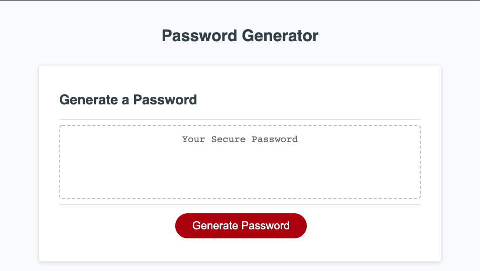

# 03-JavaScript-Password-Generator

 

## Description
Password security is extremely important.  These days using your dogs name won't cut it.  These days you want to have a nice long randomized string of unique characters.  Here's a tool for that.

## Project Goals:
- Click a button to start generating a password
- Type in password length (8 - 128 characters)
- Choose if lowercase letters are included
- Choose if uppercase letters are included
- Choose if numbers are included
- Choose if special symbols are included
- Display randomized password with preferences

## Skills Learned
- [Javascript Array](https://developer.mozilla.org/en-US/docs/Web/JavaScript/Reference/Global_Objects/Array)
- [Javascript Function](https://developer.mozilla.org/en-US/docs/Web/JavaScript/Guide/Functions)
- [Javascript Window.prompt](https://developer.mozilla.org/en-US/docs/Web/API/Window/prompt)
- [Javascript Window.confirm](https://developer.mozilla.org/en-US/docs/Web/API/Window/confirm)
- [Javascript Array.forEach](https://developer.mozilla.org/en-US/docs/Web/JavaScript/Reference/Global_Objects/Array/forEach)

## Resources
- [Javascript Reference](https://developer.mozilla.org/en-US/docs/Web/JavaScript/Reference)
- [Learn Javascript!](https://developer.mozilla.org/en-US/docs/Learn/JavaScript/First_steps)
- **General Reference ->** [MDN](https://developer.mozilla.org/en-US/)
